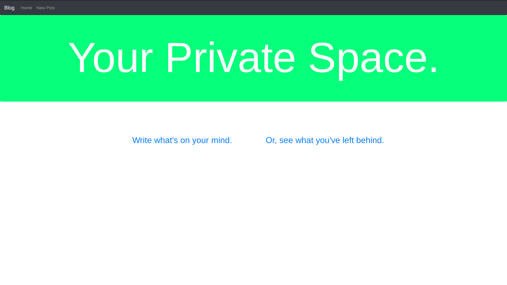
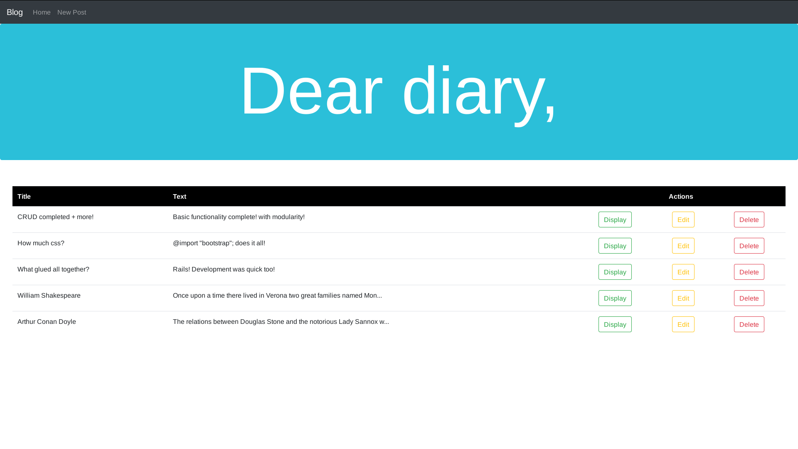
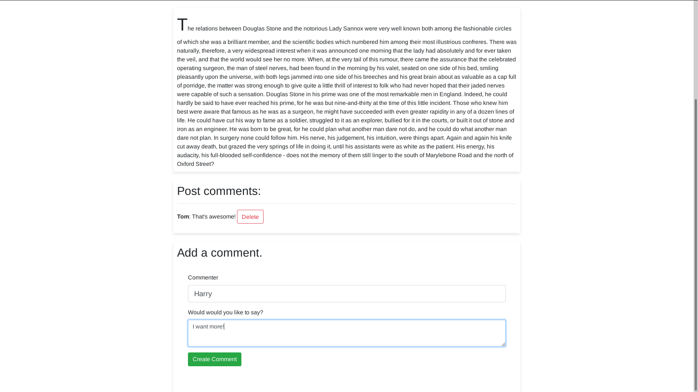
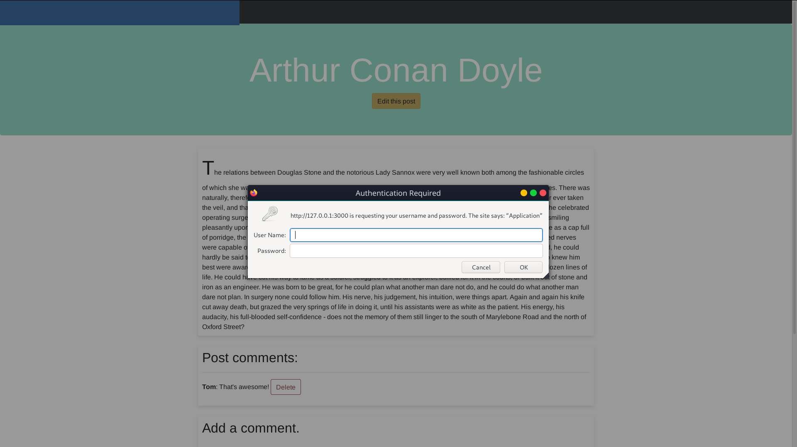
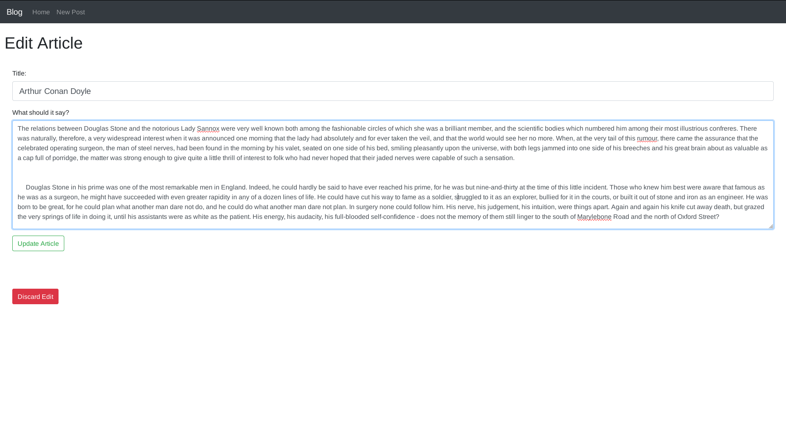
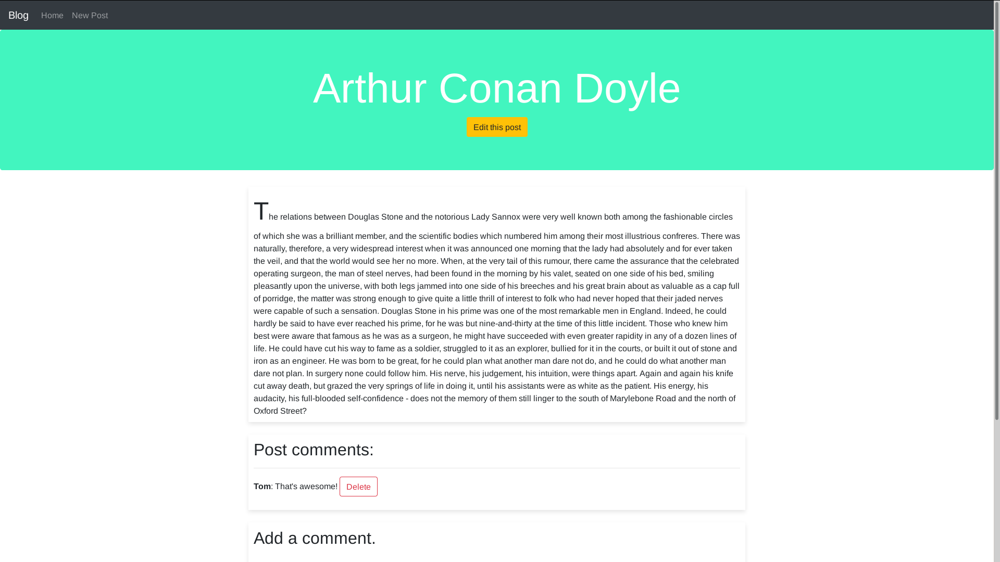

# Blog post

A rails webapp that can jot down your thoughts. Hosted on your private server. Accessible with REST api.



## Features 

*   **Ruby on Rails.**
*   CRUD articles.
        
*   CRD comments.
        
*   Basic admin authentication for deletions.
        
*   Bootstrap.
*   SQLite3 database.
*   **RESTful.**

## Requirements (Tested Configuration)

1. *ruby* --> 2.6.5p114
2. *sqlite3* --> 3.28.0
3. *rails* --> 6.0.1

## Installation

To start the server,

```ruby
rails server
```

To run the application, open your browser and type,
```
localhost:3000
```

## Extras

* Individual edit
    

* Expand article
    
